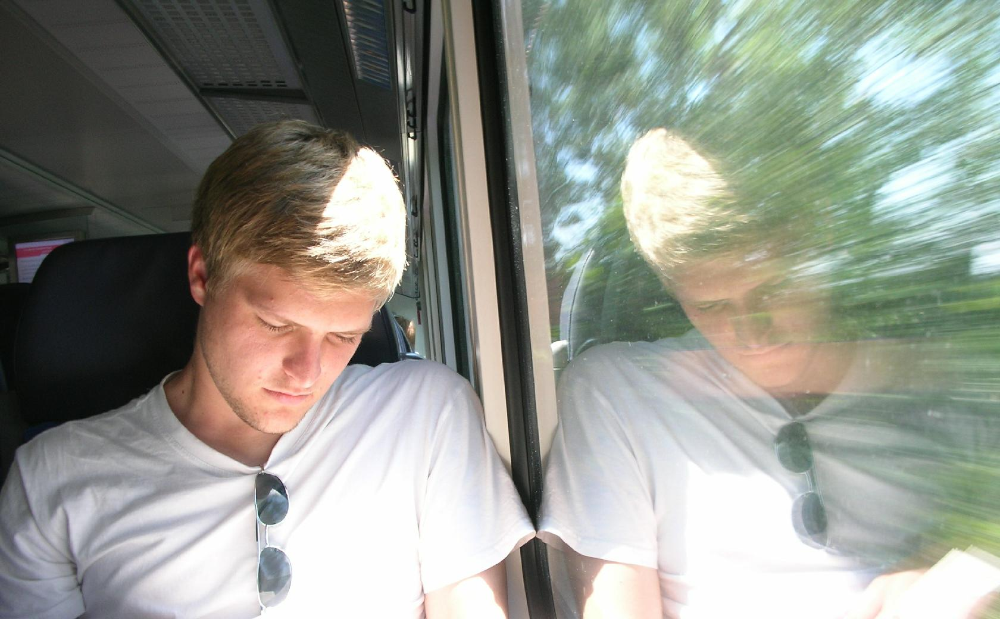

Welcome!
========

You found me, which is peculiar. I'm assuming that you're not here looking for pretty websites, since this site is clearly not it. Maybe you're looking to recruit a code monkey? Whatever it is, this is how you can [reach me](contact.html).

I could send you straight to my team's [project](~lwebley) website, or I could tell you a little about [myself](aboutme.html). I also wrote a tiny page about making this [website](thissite.html).

My [thesis](thesis.html) page describes my component of the project. It will be mirrored on the project site.

Here is a list of where else I live online:

* http://github.com/rdrey
* http://stackoverflow.com/users/357578/rdrey
* http://about.me/rdrey
* http://za.linkedin.com/in/rdrey
* https://plus.google.com/u/0/107197906257699462732
* http://www.facebook.com/rdrey
* http://www.twitter.com/rdrey1

This is what I usually look like online (currently):

