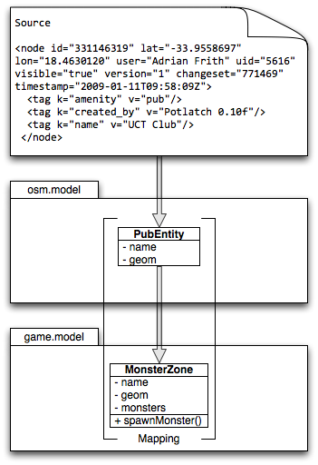
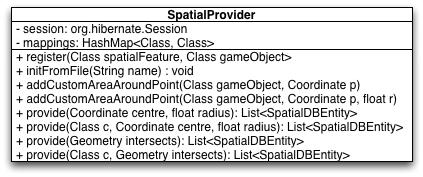

Spatial Data Provider
=====================

The Spatial (Data) Provider component provides the platform (the game server specifically) with spatial data transformed to game objects.

##Introduction & Motivation

All existing Location-Based Mobile Games (LBMGs) make use of simple spatial data, i.e. points only. Complex spatial data, such as lines for roads and areas for buildings and fields, has great unexplored gameplay potential.

This component explored the feasibility of providing complex real world data to a LBMG.

## Design

The Spatial (Data) Provider component provides the platform (the game server specifically) with spatial data transformed to game objects.

1. It parses OpenStreetMap XML data (OSM XML) for the features selected by the
   game designer

2. It converts these spatial features to game objects

3. It saves all game objects into a spatially-enabled database (PostgreSQL)

4. It allows the game designer to query for specific types of game objects
   around a certain location or within an area.

The first three steps can are illustrated by the following diagram:

The usage of this component is very easy. It provides a simple 2-method API to perform the first three steps by `register()`ing mappings and calling the `initFromFile()` method on an OSM XML file. The last step is performed by importing this component on the game server and simply calling its `provide()` method with the correct arguments.

The complete API for this component is contained in the SpatialProvider class:

##Results

We managed to provide over 80 game objects around Upper, Middle and Lower campus to game clients in less than 150 milliseconds per request.

The following diagram shows the game objects created by this component on campus, overlaid by four players moving around and interacting with these objects for an hour of game play:

We were quite satisfied with the final result. Using the component from the game server proved to be very easy and as illustrated by the images above the game objects were well utilised by the players.
